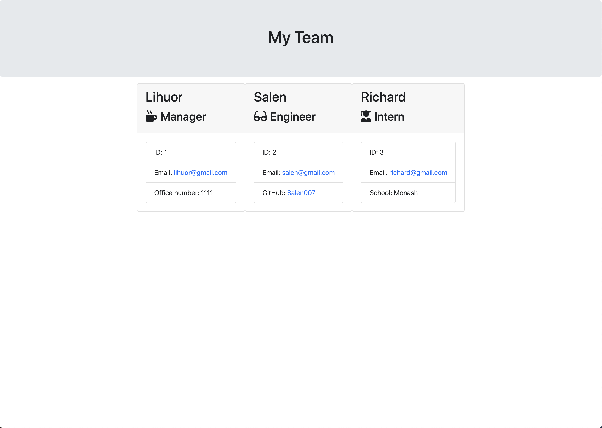

# Template Engine - Employee Summary


> Building a Node CLI that takes in information about employees and generates an HTML webpage that displays summaries for each person. All the tested passed in order to make code maintainable. a software engineering team generator command line application. The application will prompt the user for information about the team manager and then information about the team members. The user can input any number of team members, and they may be a mix of engineers and interns.

### 🏠 [Homepage](https://github.com/Lihuor/TE_Employee_Summary)

### ✨ [Demo](https://lihuor.github.io/TE_Employee_Summary/)


### 🛂 Passed Tests

## Prerequisites

- npm >=6.14.5
- node >=12.18.1

## Install

```sh
npm install
```

## Usage

```sh
npm run start
```

## Run tests

```sh
npm run test
```

## Author

👤 **Lihuor Slot**

* GitHub: [@Lihuor](https://github.com/Lihuor)
* LinkedIn: [@https:\/\/www.linkedin.com\/in\/lihuor-slot-44187684\/](https://linkedin.com/in/https:\/\/www.linkedin.com\/in\/lihuor-slot-44187684\/)

## 🤝 Contributing

Contributions, issues and feature requests are welcome!<br />Feel free to check [issues page](https://github.com/kefranabg/readme-md-generator/issues). You can also take a look at the [contributing guide](https://github.com/kefranabg/readme-md-generator/blob/master/CONTRIBUTING.md).

## Show your support

Give a ⭐️ if this project helped you!

## 📝 License

Copyright © 2020 [Lihuor Slot](https://github.com/Lihuor).<br />
This project is [MIT](https://github.com/kefranabg/readme-md-generator/blob/master/LICENSE) licensed.

***
_This README was generated with ❤️ by [readme-md-generator](https://github.com/kefranabg/readme-md-generator)_